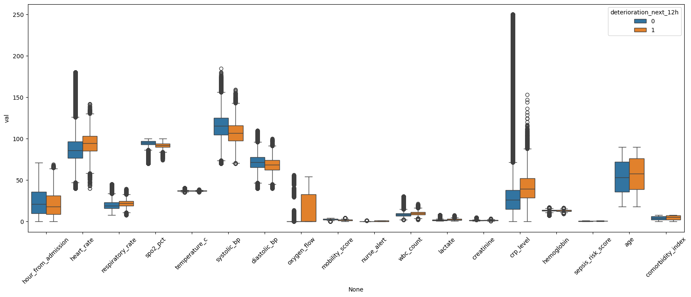
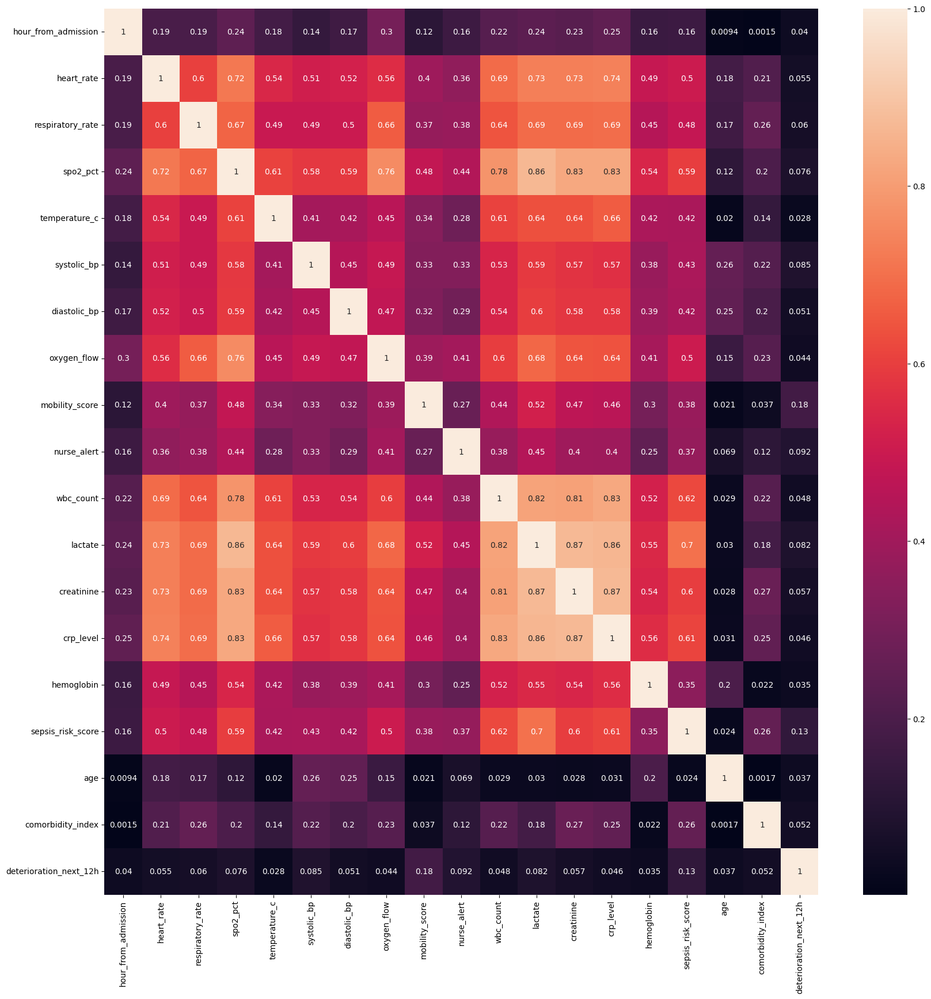
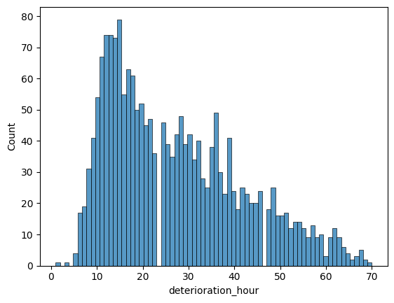
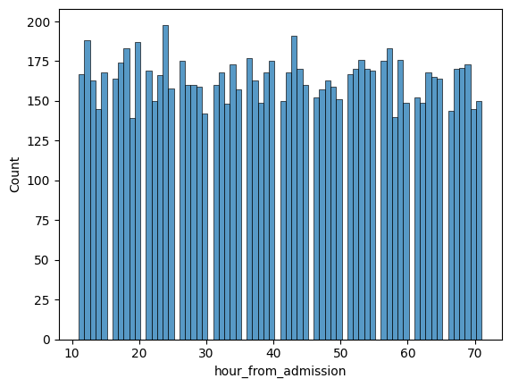
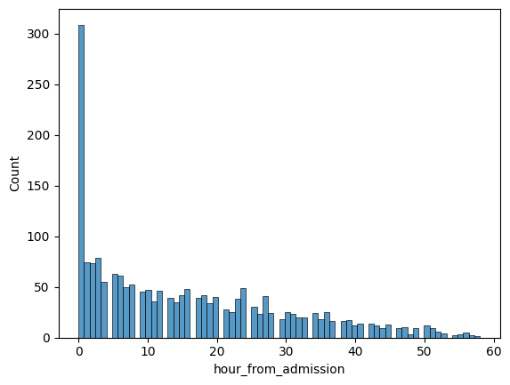
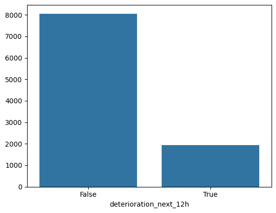
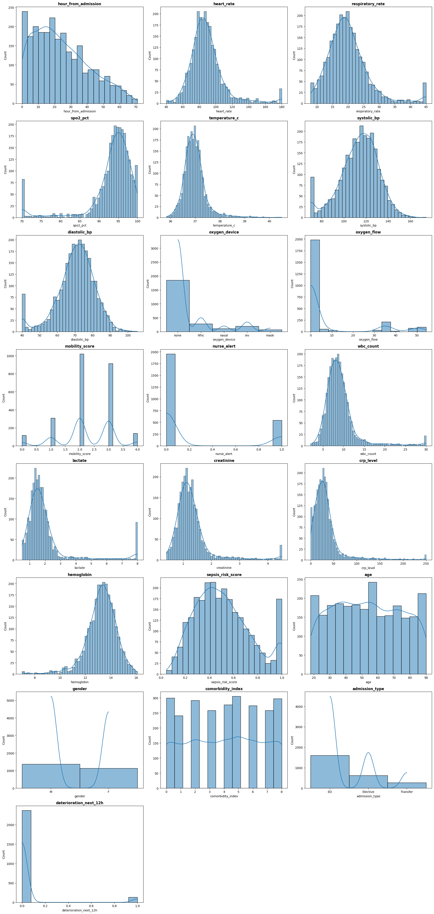
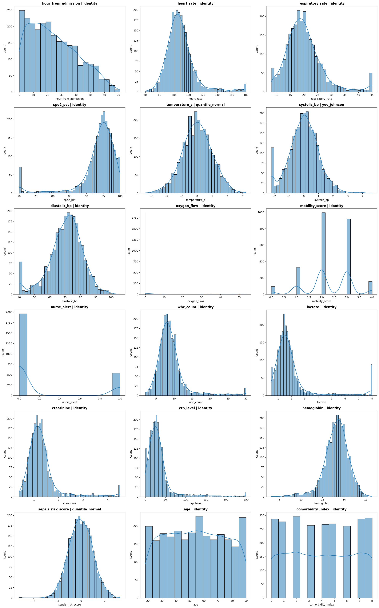
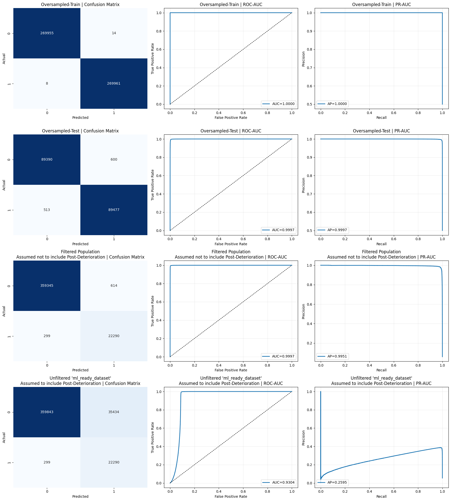

# Hospital Clinical Deterioration

## Exploratory Data Analysis (EDA)

<table>
  <tr>
    <td align="center" width="33%">
      <strong>boxplots.png</strong> 
      
    </td>
    <td align="center" width="33%">
      <strong>correlations.png</strong> 
      
    </td>
    <td align="center" width="33%">
      <strong>deterioration_hour.png</strong> 
      
    </td>
  </tr>
  <tr>
    <td align="center" width="33%">
      <strong>hour_from_admission.png</strong> 
      
    </td>
    <td align="center" width="33%">
      <strong>hour_of_first_positive_label.png</strong> 
      
    </td>
    <td align="center" width="33%">
      <strong>labels.png</strong> 
      
    </td>
  </tr>
</table>

## distribution_test_results.csv

**Label Key:** `0` = Negative, `1` = Positive

| column | normaltest | 0-normaltest | 1-normaltest | t_test | levene | ks_test |
|---|---:|---:|---:|---:|---:|---:|
| hour_from_admission | 0.0 | 0.0 | 0.0 | 9.54873659257174e-146 | 4.9418187561242016e-213 | 1.3187249931155603e-119 |
| heart_rate | 0.0 | 0.0 | 6.179070192294281e-12 | 5.321997267756283e-277 | 1.2423177472550144e-265 | 0.0 |
| respiratory_rate | 0.0 | 0.0 | 9.077144370322601e-43 | 0.0 | 0.0 | 0.0 |
| spo2_pct | 0.0 | 0.0 | 0.0 | 0.0 | 7.810617472644199e-186 | 0.0 |
| temperature_c | 0.0 | 0.0 | 4.856935091401447e-35 | 4.877740105839164e-75 | 3.402192450288426e-114 | 0.0 |
| systolic_bp | 0.0 | 0.0 | 5.499956045065794e-49 | 0.0 | 3.524597417608688e-251 | 0.0 |
| diastolic_bp | 0.0 | 0.0 | 0.11915178876197988 | 3.677097514857987e-238 | 3.555900580177477e-139 | 0.0 |
| oxygen_flow | 0.0 | 0.0 | 0.0 | 6.007587626890501e-180 | 6.007587626891364e-180 | 0.0 |
| mobility_score | 0.0 | 0.0 | 2.4897227684713144e-71 | 0.0 | 4.273370627092458e-15 | 0.0 |
| nurse_alert | 0.0 | 0.0 | 0.0 | 0.0 | 0.0 | 0.0 |
| wbc_count | 0.0 | 0.0 | 1.65363200088665e-94 | 4.177281847079621e-209 | 9.189958663469131e-136 | 0.0 |
| lactate | 0.0 | 0.0 | 0.0 | 0.0 | 1.75843719996068e-32 | 0.0 |
| creatinine | 0.0 | 0.0 | 1.1478605113514155e-163 | 3.1500860754715386e-294 | 2.958443677759198e-134 | 0.0 |
| crp_level | 0.0 | 0.0 | 1.9864170937321073e-280 | 9.082008595181464e-197 | 4.6106127985012624e-129 | 0.0 |
| hemoglobin | 0.0 | 0.0 | 7.763729989866682e-17 | 3.51550903703871e-115 | 9.614363911924005e-106 | 6.2498368203614175e-258 |
| sepsis_risk_score | 0.0 | 0.0 | 0.0 | 0.0 | 3.3725307185002813e-46 | 0.0 |
| age | 0.0 | 0.0 | 0.0 | 4.789706764701239e-125 | 0.979258721484419 | 9.714886869424172e-117 |
| comorbidity_index | 0.0 | 0.0 | 0.0 | 3.4988854446342266e-245 | 3.382823583314732e-10 | 1.6108840668830118e-188 |
| deterioration_next_12h | 0.0 |  |  | 0.0 |  | 0.0 |

## Transformation Results

<table>
  <tr>
    <td align="center" width="33%">
      <strong>before_transformation_histplots.png</strong> 
      
    </td>
    <td align="center" width="33%">
      <strong>best_scaled_norms.csv</strong> 
      <table>
        <thead>
          <tr>
            <th>column</th>
            <th>best_scaler</th>
            <th>statistic</th>
            <th>pvalue</th>
            <th>reason</th>
          </tr>
        </thead>
        <tbody>
          <tr><td>temperature_c</td><td>quantile_normal</td><td>43.12617910937395</td><td>4.31786633043763e-10</td><td>normaltest</td></tr>
          <tr><td>systolic_bp</td><td>yeo_johnson</td><td>599.2278389842614</td><td>7.574048175410705e-131</td><td>normaltest</td></tr>
          <tr><td>sepsis_risk_score</td><td>quantile_normal</td><td>983.9544855328645</td><td>2.17269239672455e-214</td><td>normaltest</td></tr>
          <tr><td>age</td><td>identity</td><td>319644.5069098969</td><td>0.0</td><td>normaltest</td></tr>
          <tr><td>comorbidity_index</td><td>identity</td><td>599627.268702247</td><td>0.0</td><td>normaltest</td></tr>
          <tr><td>creatinine</td><td>identity</td><td>248027.10007383677</td><td>0.0</td><td>normaltest</td></tr>
          <tr><td>crp_level</td><td>identity</td><td>298830.26009094657</td><td>0.0</td><td>normaltest</td></tr>
          <tr><td>diastolic_bp</td><td>identity</td><td>30704.118568589518</td><td>0.0</td><td>normaltest</td></tr>
          <tr><td>heart_rate</td><td>identity</td><td>150880.26367400255</td><td>0.0</td><td>normaltest</td></tr>
          <tr><td>hemoglobin</td><td>identity</td><td>81861.55143755313</td><td>0.0</td><td>normaltest</td></tr>
          <tr><td>hour_from_admission</td><td>identity</td><td>32151.356125344653</td><td>0.0</td><td>normaltest</td></tr>
          <tr><td>lactate</td><td>identity</td><td>241139.66374216718</td><td>0.0</td><td>normaltest</td></tr>
          <tr><td>mobility_score</td><td>identity</td><td>12323.337173161188</td><td>0.0</td><td>normaltest</td></tr>
          <tr><td>nurse_alert</td><td>identity</td><td>76021.28012412696</td><td>0.0</td><td>normaltest</td></tr>
          <tr><td>oxygen_flow</td><td>identity</td><td>116759.35614298255</td><td>0.0</td><td>normaltest</td></tr>
          <tr><td>respiratory_rate</td><td>identity</td><td>100491.65106422373</td><td>0.0</td><td>normaltest</td></tr>
          <tr><td>spo2_pct</td><td>identity</td><td>209236.48536760325</td><td>0.0</td><td>normaltest</td></tr>
          <tr><td>wbc_count</td><td>identity</td><td>234406.55983832828</td><td>0.0</td><td>normaltest</td></tr>
        </tbody>
      </table>
    </td>
    <td align="center" width="33%">
      <strong>after_transformation_test_resulsts.png</strong> 
      
    </td>
  </tr>
</table>

## Best Model: XGBoost Classifier

### selected_model_xgbc.csv

| dataset_label | n_rows | accuracy | recall | precision | f1 | roc_auc |
|---|---:|---:|---:|---:|---:|---:|
| Oversampled-Train | 539938 | 0.9999592545810815 | 0.9999703669680593 | 0.9999481433466062 | 0.9999592550338554 | 0.9999999932494787 |
| Oversampled-Test | 179980 | 0.9938159795532837 | 0.9942993665962885 | 0.9933390321613731 | 0.9938189673843625 | 0.9996975950865923 |
| Filtered Population Assumed not to include Post-Deterioration | 382548 | 0.9976133713939166 | 0.9867634689450617 | 0.9731924554662941 | 0.9799309783922802 | 0.9996922719265956 |
| Unfiltered 'ml_ready_dataset' Assumed to include Post-Deterioration | 417866 | 0.9144869407896311 | 0.9867634689450617 | 0.38614787610006235 | 0.5550782563221396 | 0.9304258382370492 |

### selected_model_plots.png

[View the notebook on Kaggle](https://www.kaggle.com/code/lelandmesford/hcd-model)

## Other Model Variations

[View additional HCD model variations on Kaggle](https://www.kaggle.com/code/lelandmesford/hcd-model-variations)
